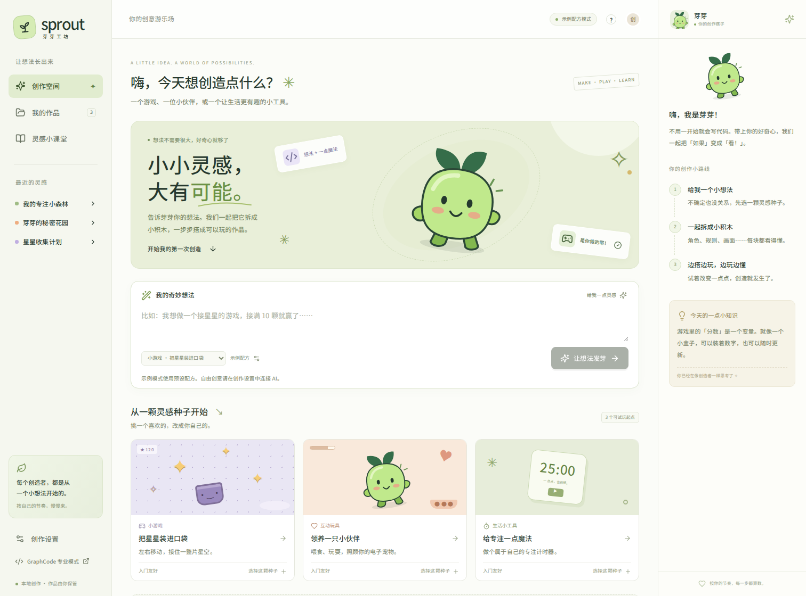

# Sprout · 芽芽工坊

**把点子种出来，把每一步看明白。**

基于 [GraphCode](https://github.com/JustinLinKK/graph-code) 的儿童与初学者创作工坊：把一个想法拆成可理解的模块，逐块生成源码，边搭边玩，再做自己的修改。面向 10–16 岁亲子和创作社团的本地 hackathon 原型；保留原专业图工作台、coding、review、API 与本地 CLI 能力。



## 立即运行

要求 Node.js 22+、Git、Corepack；本次实测 Node 24.18.0、pnpm 10.33.0。

```bash
corepack pnpm install --frozen-lockfile
corepack pnpm dev
```

打开 **http://127.0.0.1:5173/**。可选运行 `corepack pnpm demo:seed` 添加三个已搭好的演示作品，不清空现有作品。无需 API 密钥即可运行三种预设作品。后端默认 `127.0.0.1:3010`；保持终端运行。默认不启动任何付费模型调用。

- 工坊：`/`，输入创意 → 选择模式 → 生成模块 → 逐块搭建 → 试玩 → 修改 → 导出。
- 专业工作台：`/#expert`，沿用 GraphCode 的原始操作与能力；左下角返回工坊。
- 路演：直接打开 [pitch-deck.html](docs/pitch-deck.html)，左右键/空格翻页；另有 [PDF](docs/pitch-deck.pdf) 和 [PowerPoint](docs/pitch-deck.pptx)。

## 三条可玩的路径

| 起点 | 交互 | 可以学到什么 |
| --- | --- | --- |
| 接星星 | 键盘/鼠标/触摸控制、计分、胜负、重玩、声音 | 循环、条件、事件、难度参数 |
| 电子宠物 | 喂食/玩耍/休息、状态上限、开花、重置 | 变量、状态、多个条件 |
| 专注计时器 | 开始/暂停/继续/重置、到时反馈 | 时间、事件与状态转换 |

每块积木有真实源码、文件名、依赖、概念与挑战。进度及作品保存在服务端本地目录；学习自查和发现保存在当前浏览器。从工坊按钮导出的 HTML 可离线打开，并内嵌中文字体及OFL许可；JSON包含全部模块源码。直接调用后端HTML接口的导出不内嵌字体，使用系统字体。[导出到专业模式](docs/export-to-expert.md) 可将这些模块落成真实项目文件。

**示例配方不会调用 AI，也不会按任意输入生成新玩法。** 在设置中切换 Codex 或 API 后，新作品才进行真实任务拆解和自由描述修改；已有作品保留创建时的提供方。参数调整对示例有效；AI 作品是否响应某个参数取决于生成源码。

本次运行与浏览器验收均在 Ubuntu 完成，尚未完成原生 Windows 验收。Windows 的界面和示例预计一致，但 `better-sqlite3` 安装若回退到源码编译，仍需 C++ Build Tools；新工坊当前的 Codex 启动方式尚未适配 `codex.cmd`。完整试运行建议在 WSL2 Ubuntu 内重新安装 Linux 依赖并登录 Codex，不要复制其他系统的 `node_modules`。外部 API 模式不依赖本地 Codex CLI。

## 使用真实模型

本机 Codex：在启动服务的同一 OS 用户和终端环境安装并登录 Codex CLI，再打开「创作设置」。工坊会检测 `codex login status`。使用你的已有额度；不会把账号凭据发给浏览器。原 GraphCode 的更多模型设置继续在专业工作台使用。

外部 API：新工坊使用兼容 OpenAI Chat Completions 的服务端接口，要求 JSON 响应。复制 `.env.example` 仅作配置参考，服务**不会自动读取 `.env`**；通过进程环境传入，或由你自己的环境管理器加载。

```bash
export SPROUT_API_KEY='你的密钥'
export SPROUT_API_BASE='https://api.openai.com/v1'
export SPROUT_MODEL='你的提供方支持的模型名称'
corepack pnpm dev
```

Windows PowerShell 使用 `$env:SPROUT_API_KEY='…'` 等环境变量赋值。不要把密钥写进前端、提交 Git 或公开截图。API 模式是否可用只表示已配置；模型权限/额度仍由提供方校验。外部 API 协议已用本地 HTTP fixture 验证，本次真实生成使用 Codex，未假称实付 API 全供应商验证。

| 可选变量 | 用途 |
| --- | --- |
| `SPROUT_CODEX_MODEL` | 覆盖本地 Codex 默认模型 |
| `SPROUT_CODEX_COMMAND` | Codex 可执行文件路径 |
| `SPROUT_DATA_PATH` | 作品目录；默认根目录 `.graphcode/studio` |
| `SPROUT_ALLOWED_ORIGINS` | 额外允许的页面来源，逗号分隔；默认本机页面 |
| `GRAPHCODE_SERVER_PORT` / `GRAPHCODE_WEB_PORT` | 后端/前端端口 |

新工坊 Codex adapter 只请求 JSON 文本，禁用工具并在临时目录运行；不会运行生成代码。作品在 `sandbox="allow-scripts"` 的隔离 iframe 中试玩，CSP 禁止联网，导出文件也带 CSP。这些措施不等于公开未成年人云服务的完整安全认证。专业工作台保留原有本地文件权限，请由成人/开发者操作。

## 验证与材料

```bash
corepack pnpm build
corepack pnpm typecheck
corepack pnpm test
corepack pnpm exec playwright install chromium
corepack pnpm test:ui
corepack pnpm test:expert:visual
corepack pnpm test:export
corepack pnpm audit:preservation
corepack pnpm benchmark:minibuild
```

`benchmark:minibuild` 默认重放保存产物，**不消耗模型额度**。真实模型命令、样本、原始结果、耗时和局限见 [benchmark.md](docs/benchmark.md)。单独跑工坊浏览器验收：`corepack pnpm --filter @graphcode/web exec playwright test e2e/studio.spec.ts`。

- [验收报告与需求映射](docs/delivery/acceptance.md)
- [3 分钟演示操作与失败恢复](docs/demo-guide.md)
- [源码研究与原能力保留](docs/source-audit.md)
- [市场/竞品研究](docs/research/market-research.md) · [22 个来源](docs/research/sources.md)
- [Business plan](docs/business-plan.md) · [PDF](docs/business-plan.pdf)
- [14 页路演内容、讲稿与问答](docs/pitch-content.md)
- [品牌/IP 规范](docs/brand-guide.md)
- [上游 README 原文](docs/graphcode-upstream-readme.md)

真实产品验证包含：Codex 一次规划及四次模块生成，约 172 秒，生成计时器 10/10 浏览器行为检查通过。自建 MiniBuild-3 为 3 个逻辑任务、24 个用例；它不是公共榜单、儿童学习效果或通用应用成功率。原有 context fixture 甚至出现估计 token 增长，报告保留该结果。

AR/VR、语音在基线中仅为路线图；不宣称已有实现。保留的是图拖拽、缩放、连边/边界绘制、源码定位等实际交互。订阅、云端身份、家长控制、教师后台和社区是商业计划中的下一阶段，不是已上线功能。价格、收入及获客数字均为明确标注的假设。

## 代码与许可

上游固定于 `423912335b494ed259a0432f64334873dc461e7e`，MIT 许可及原作者署名保留于 [LICENSE](LICENSE)。新增层位于 `apps/web/src/studio` 与 `apps/local-server/src/studio`；专业引擎四个 `packages` 未修改。中文字体为 Noto Sans SC，SIL Open Font License 见 `apps/web/public/fonts/OFL.txt`；字体自托管，不调用外部字体服务。品牌/IP 为本次原创代码 SVG，名称尚未作商标清查。

远程 Sprout 仓库初始化时的 README 与 Apache 2.0 许可证原文保存在 [历史归档](docs/history/sprout-initial/provenance.md)。
